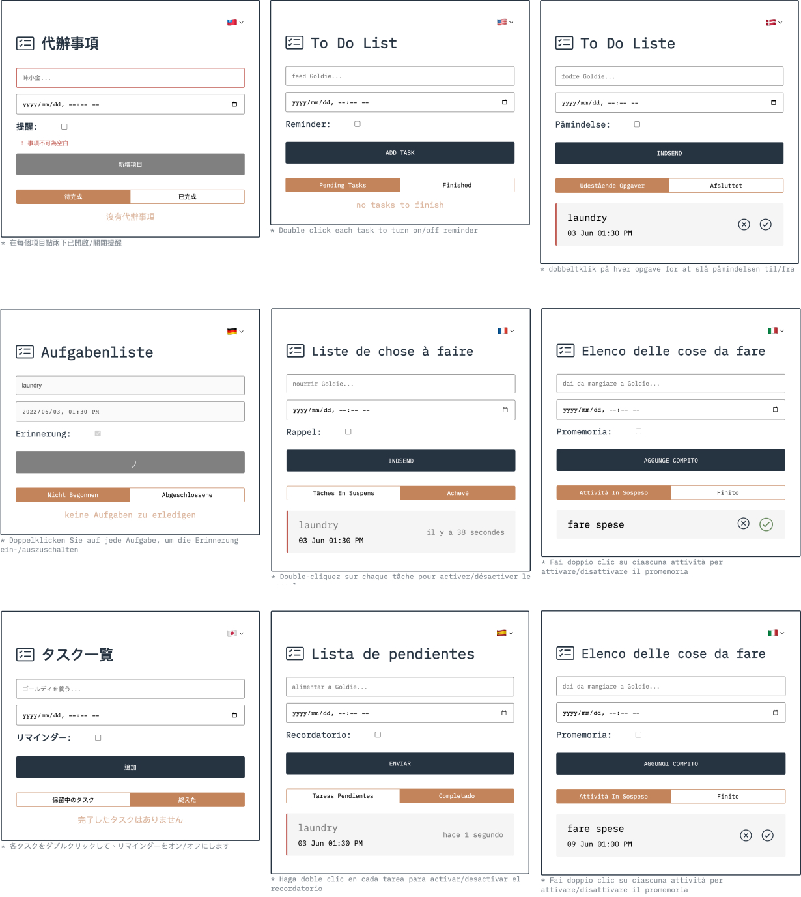

<h1 align="center">Todo-List 2.0 Multilngual
</h1>
<p align="center">
  <a href="https://todo-list-v2-multilingual.vercel.app/"></a>  
</p>
<div align="center">
  


</div>

## 📄 Description

A multilingyal to-do list built using React, and local storage, with customized page transitions.

## 🛠 Tools Used

- [i18next](https://github.com/i18next/i18next)
- [moment.js](https://momentjs.com/)
- [uuid](https://www.npmjs.com/package/uuid)
- [react-loader-spinner](https://mhnpd.github.io/react-loader-spinner/)
- [styled-components](https://www.styled-components.com/)

## ✨ USAGE

1. Clone this Repo to your local enviromnent

```
git clone https://github.com/EchoChunyuShih/todo-list-2.0-multilingual.git
```

2. Install dependencies

```
$ npm i
```

3. run the project

```
$ npm start
```

## 🥳 Live Demo


